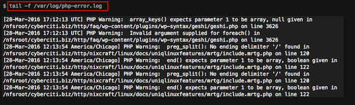
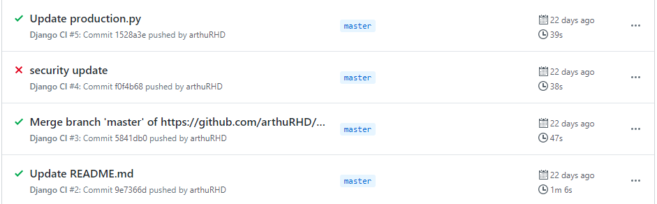
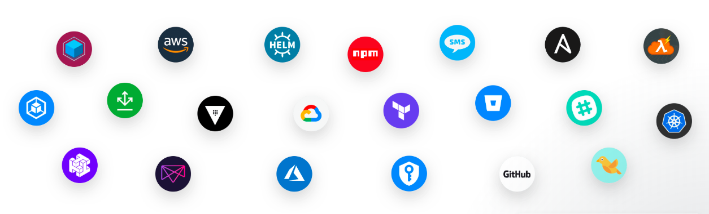

# Intégration Continue

> Arthur RICHARD 2TSIO

- [Intégration Continue](#intégration-continue)
  - [Introduction](#introduction)
  - [Dans la pratique](#dans-la-pratique)
  - [Outils de CI](#outils-de-ci)

## Introduction

Le concept d'intégration continue s'inscrit dans la démarche DevOps, c'est un processus qui vise à `gagner du temps` dans le développement d'une application.

Il est aussi intéressant de noter qu'une intégration continue n'est pas nécessaire à chacunes des applications que vous êtes en train de développer. En effet, l'intégration continue se démarque lorsque vous êtes sur un projet ayant beaucoup de contributeurs.

En étant plusieurs sur un projet, il se peut qu'un contributeur réalise un `commit` pourri sur le serveur de gestion de version. Ce commit peut définitivement altérer le fonctionnement de l'application et pire encore, servir de référence pour le développement de nouveaux modules.


Afin d'éviter cela, on automatise les tests à chaque commit.

Lorsque vous rencontrez une erreur inconnue au bataillon dans le développement de votre application, vous consultez normalement les `logs` afin de déduire rapidement les événements qui ont échoués et de régler le problème.



L'intégration continue fonctionne de la même manière. Grâce à l'historique des commits, on peut rapidement déterminer quel commit est défectueux et corriger l'erreur avant de commit à nouveau.



## Dans la pratique

La plupart des outils de `CI` (Continuous Integration) demande à l'utilisateur de configurer un ficher `.yml` qui sont plus ou moins similaire selon les outils :

```yml
name: MyApp CI # Le nom du workflow (processus), il est important de différencier les workflows entre-eux

on: # Définit les conditions d'éxécutions du processus
    push: # Lors d'un git push sur la branche principale
        branches: [ master ]
    pull_request: # Lors d'une demande de git pull sur la branche principale
        branches: [ master ]

jobs:
    build:
        runs-on: ubuntu-latest # Image docker

        steps:
        - name: Installation de python
          uses: actions/setup-python@v1 # Utilise un modèle prédéfini de GitHub Actions pour Python
          with:
            python-version: 3.8
        - name: Installation des dépendances
          run: |
            python -m pip install --upgrade pip
            pip install pylint pytest
            if [ -f requirements.txt ]; then pip install -r requirements.txt; fi
        - name: Tests unitaires
          run: |
            pytest
        - name: Tests de syntaxe (Lint)
          run: |
            pylint myscript.py
```


Selon les outils, vous allez devoir héberger vous même les conteneurs Docker. C'est une option intéressante si on est soucieux de la confidentialité des processus.

La plupart des outils de CI sont comptatible avec le déploiement continue. Avec ces mêmes fichier YAML, vous pouvez déployer votre application sur une plateforme de votre choix



## Outils de CI

|      Nom       |                              Site officiel                               |                           Avantages                            |                                Désavantages                                 |   Prix   |
| :------------: | :----------------------------------------------------------------------: | :------------------------------------------------------------: | :-------------------------------------------------------------------------: | :------: |
| GitHub Actions | [https://help.github.com/en/actions](https://help.github.com/en/actions) |    Très facile à prendre en main, pas besoin d'installation    | Nécéssite de d'utiliser GitHub comme dépôt de fichiers, peu personnalisable | Gratuit  |
|   Gitlab CI    |     [https://docs.gitlab.com/ee/ci/](https://docs.gitlab.com/ee/ci/)     |      Bonne interface graphique pour visualiser les tests       |                           Problème de scalabilité                           | Gratuit  |
|    Jenkins     |            [https://www.jenkins.io/](https://www.jenkins.io/)            | Open-source et compatible avec tous les OS, facile à installer |                     Moins complet que les autres outils                     | Gratuit  |
|   Circle CI    |         [https://circleci.com/docs/](https://circleci.com/docs/)         | Privé et auto-scale, teste rapidement et très personnalisable  |  l'offre gratuite est moins bien efficace que les autres (1 job à la fois)  | Freenium |
